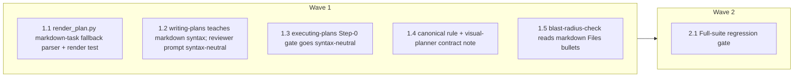

# Plan Format v2 — Markdown First-Class, XML Optional

<!-- AT-A-GLANCE:BEGIN (generated — do not edit; refreshed by render_plan.py --summarize) -->
## At a glance

**6 tasks · 2 waves · 10 files · 3/6 done**

| Wave | Task | Title | Files | Done (acceptance) |
|---|---|---|---|---|
| 1 | 1.1 | render_plan.py markdown-task fallback parser + render test | skills/visual-planner/render_plan.py, tests/hooks/render-plan-on-write.test.sh | Markdown-syntax plan renders task cards + non-empty At-a-glance; existing XML fi… |
| 1 | 1.2 | writing-plans teaches markdown syntax; reviewer prompt syntax-neutral | skills/writing-plans/SKILL.md, skills/writing-plans/plan-document-reviewer-prompt.md | writing-plans contains no rival/legacy format, teaches the markdown syntax, revi… |
| 1 | 1.3 | executing-plans Step-0 gate goes syntax-neutral | skills/executing-plans/SKILL.md | Step 0 accepts markdown-syntax plans and still rejects tasks with missing fields… |
| 1 | 1.4 | canonical rule + visual-planner contract note | rules/plan-format.md, skills/visual-planner/SKILL.md | plan-format.md is the single canonical definition of BOTH syntaxes; visual-plann… |
| 1 | 1.5 | blast-radius-check reads markdown Files bullets | hooks/blast-radius-check.sh, tests/hooks/blast-radius-check.test.sh | Markdown plans get identical scope-creep coverage to XML plans; all existing cas… |
| 2 | 2.1 | Full-suite regression gate | (none — verification only) | Full suite exit 0; existing XML plan renders unchanged. |



### Progress
- [x] 1.1 — render_plan.py markdown-task fallback parser + render test
- [ ] 1.2 — writing-plans teaches markdown syntax; reviewer prompt syntax-neutral
- [ ] 1.3 — executing-plans Step-0 gate goes syntax-neutral
- [ ] 1.4 — canonical rule + visual-planner contract note
- [x] 1.5 — blast-radius-check reads markdown Files bullets
- [x] 2.1 — Full-suite regression gate
<!-- AT-A-GLANCE:END -->

## 1. Motivation

User directive (2026-07-16): XML is no longer mandatory for plans. Fix the chain so a plain-markdown plan is accepted end-to-end: writing-plans (authoring), executing-plans (Step-0 gate), render_plan.py (HTML render + At-a-glance), plus the canonical rule and the `<files>`-reading hook the directive implies. Also lands the original C1 fix (delete the superpowers checkbox format that nothing accepts). Evidence: `research-brief.md`; decision record: `design.md` (v2 — one semantic schema, two syntaxes).

## 2. Non-goals

No deprecation of XML (19 existing plans, zero migration). No changes to `check_plan_format.py` (no callers — issue #67 pending), s-d-d dispatch mechanics, or the At-a-glance block's shape. No new lint.

## 3. Success Criteria

- A markdown-syntax plan (per plan-format.md's new example) renders task cards + At-a-glance in PLAN.html, passes executing-plans Step 0, and its `- **Files:**` set feeds blast-radius-check.
- All 19 existing XML plans render byte-identically (XML path untouched).
- The old checkbox-format markers are gone from `skills/` (C1).
- Full harness test suite green before and after.

## 4. Tasks

### Task 1.1 — render_plan.py markdown-task fallback parser + render test

```xml
<task id="1.1" wave="1">
  <files>skills/visual-planner/render_plan.py, tests/hooks/render-plan-on-write.test.sh</files>
  <action>Per design.md §Component-1: add _extract_md_tasks(body) — scan the fence-masked body for headings matching `### Task &lt;id&gt; [— title] [(wave K)]`; span = heading start → next ##/### heading (masked copy for detection, ORIGINAL body for slicing, same pattern as the XML path); within each span parse `- **Files/Action/Verify/Done:**` bullets case-insensitively with indented continuation lines; a heading with zero field bullets is prose, not a task. Wire as fallback inside extract_tasks() when the XML scan returns no tasks, returning the identical (tasks, spans) contract with dicts {id, wave, files, action, verify, done} (wave default "—"). Do not touch the XML path. Extend tests/hooks/render-plan-on-write.test.sh with a markdown-syntax PLAN.md case asserting the rendered PLAN.html contains the task id and file path.</action>
  <verify>bash tests/hooks/render-plan-on-write.test.sh && python3 skills/visual-planner/render_plan.py specs/writing-plans-format-fix/PLAN.md --check-only 2>/dev/null || bash tests/hooks/render-plan-on-write.test.sh</verify>
  <done>Markdown-syntax plan renders task cards + non-empty At-a-glance; existing XML fixture cases still pass; extract_tasks return contract unchanged at all 3 call sites.</done>
</task>
```

### Task 1.2 — writing-plans teaches markdown syntax; reviewer prompt syntax-neutral

```xml
<task id="1.2" wave="1">
  <files>skills/writing-plans/SKILL.md, skills/writing-plans/plan-document-reviewer-prompt.md</files>
  <action>Apply design v1 deletions (Bite-Sized Task Granularity, Plan Document Header, Task Structure sections; fix line-16 stale "created by brainstorming" claim; trim absorbed Remember bullets) and insert the "Plan Format" replacement section per design.md §Component-3: canonical pointer to rules/plan-format.md, one compact markdown-syntax task example, note that fenced XML blocks are equally valid, frontmatter requirement, authoring bullets (exact paths, complete code, test-first ordering inside Action, exact command in Verify). Update plan-document-reviewer-prompt.md rows 25/28: Readability + Task Syntax checks accept EITHER a fenced xml task block OR a `### Task` heading with the four field bullets, all four fields populated.</action>
  <verify>bash -c 'f=skills/writing-plans/SKILL.md; ! grep -qE "Bite-Sized|Plan Document Header|Step 1: Write the failing test|created by brainstorming skill" "$f" && grep -q "rules/plan-format.md" "$f" && grep -qi "### Task" skills/writing-plans/plan-document-reviewer-prompt.md && bash scripts/lint-doc-truth.sh'</verify>
  <done>writing-plans contains no rival/legacy format, teaches the markdown syntax, reviewer prompt accepts both syntaxes; doc-truth lint exit 0.</done>
</task>
```

### Task 1.3 — executing-plans Step-0 gate goes syntax-neutral

```xml
<task id="1.3" wave="1">
  <files>skills/executing-plans/SKILL.md</files>
  <action>Rewrite Step 0 checks 1–3 to be semantic, per design.md §Component-2: a task is EITHER a `&lt;task&gt;` XML block OR a `### Task &lt;id&gt;` heading with field bullets; check 1 = all four fields (Files/Action/Verify/Done) populated per task in either syntax; checks 2–4 unchanged in substance (zero same-wave overlap, automated verify, scope threshold) with wording made syntax-neutral. Fix line 67 → "Execute the task's action exactly and run its verify command". No other edits.</action>
  <verify>bash -c '! grep -q "bite-sized" skills/executing-plans/SKILL.md && grep -qi "either" skills/executing-plans/SKILL.md && grep -q "plan-format.md" skills/executing-plans/SKILL.md'</verify>
  <done>Step 0 accepts markdown-syntax plans and still rejects tasks with missing fields; checkbox echo gone.</done>
</task>
```

### Task 1.4 — canonical rule + visual-planner contract note

```xml
<task id="1.4" wave="1">
  <files>rules/plan-format.md, skills/visual-planner/SKILL.md</files>
  <action>Per design.md §Component-5/7: in rules/plan-format.md rename "XML Schema" → "Task Schema — two syntaxes", add the markdown-syntax definition + example alongside XML, scope the "Rendering requirement (Markdown-safe)" fencing rule to XML tasks only (markdown tasks are written plain, never fenced), extend wave conventions (`wave="K"` attribute or `(wave K)` heading suffix), update the At-a-glance paragraph to "derived from the task blocks (either syntax)". In skills/visual-planner/SKILL.md update the parsing-contract bullets (~line 190) to document the markdown fallback (XML wins in mixed files; heading without field bullets = prose). Mirror the rules/ change into .claude/rules/plan-format.md if the repo keeps a deployed copy (check how rules/ is synced; follow existing convention).</action>
  <verify>bash -c 'grep -qi "two syntaxes" rules/plan-format.md && grep -qi "### Task" rules/plan-format.md && grep -qi "markdown" skills/visual-planner/SKILL.md && bash scripts/lint-doc-truth.sh'</verify>
  <done>plan-format.md is the single canonical definition of BOTH syntaxes; visual-planner contract documents the fallback; no doc restates the schema.</done>
</task>
```

### Task 1.5 — blast-radius-check reads markdown Files bullets

```xml
<task id="1.5" wave="1">
  <files>hooks/blast-radius-check.sh, tests/hooks/blast-radius-check.test.sh</files>
  <action>Per design.md §Component-6: extend the DECLARED extraction to also collect `- **Files:**` bullet lines (case-insensitive on "Files") from the active PLAN.md, split on commas, trimmed, merged with the existing &lt;files&gt; tag set. Advisory hook — keep never-block behavior byte-identical. Add test cases: markdown-declared file edited → silent; file outside markdown-declared set → warning emitted; mixed XML+markdown plan unions both sets.</action>
  <verify>bash tests/hooks/blast-radius-check.test.sh</verify>
  <done>Markdown plans get identical scope-creep coverage to XML plans; all existing cases green.</done>
</task>
```

### Task 2.1 — Full-suite regression gate

```xml
<task id="2.1" wave="2">
  <files>(none — verification only)</files>
  <action>Run the full CI-equivalent suite (hook tests incl. render + blast-radius, script tests, doc-truth lint). Then smoke-render one real existing XML plan (specs/plan-at-a-glance/PLAN.md) and diff its PLAN.html against a pre-change render to confirm the XML path is untouched. Fix forward only within task 1.1–1.5 file scope.</action>
  <verify>bash scripts/run-tests.sh</verify>
  <done>Full suite exit 0; existing XML plan renders unchanged.</done>
</task>
```

## 5. Risks

- `render_plan.py` + `hooks/*` are high-blast (Rule-4) surfaces — change explicitly directed by the user (SUMMARY records the authorization); parser is fallback-only so the XML path is untouched by construction.
- Fenced markdown-task *examples* could false-positive the blast-radius grep — advisory-only hook, documented in its test.
- Parser/gate divergence — both cite plan-format.md's example; render test pins the parser to that example verbatim.

## 6. Status Log

- 2026-07-16 — plan v1 (dedup-to-XML) proposed.
- 2026-07-16 — user directive: XML no longer mandatory; design + plan rewritten to v2 (dual syntax); status remains proposed pending execution.
- 2026-07-16 — executed tasks 1.1–1.5 + 2.1 on `feat/plan-format-markdown`: markdown fallback parser in render_plan.py (all 3 call sites verified: render, --summarize, --emit-files), writing-plans + reviewer prompt teach/accept both syntaxes, executing-plans Step-0 syntax-neutral, plan-format.md canonical dual-syntax, blast-radius reads `- **Files:**` bullets. Full suite ALL GREEN; existing XML plan render byte-identical to pre-change baseline.
